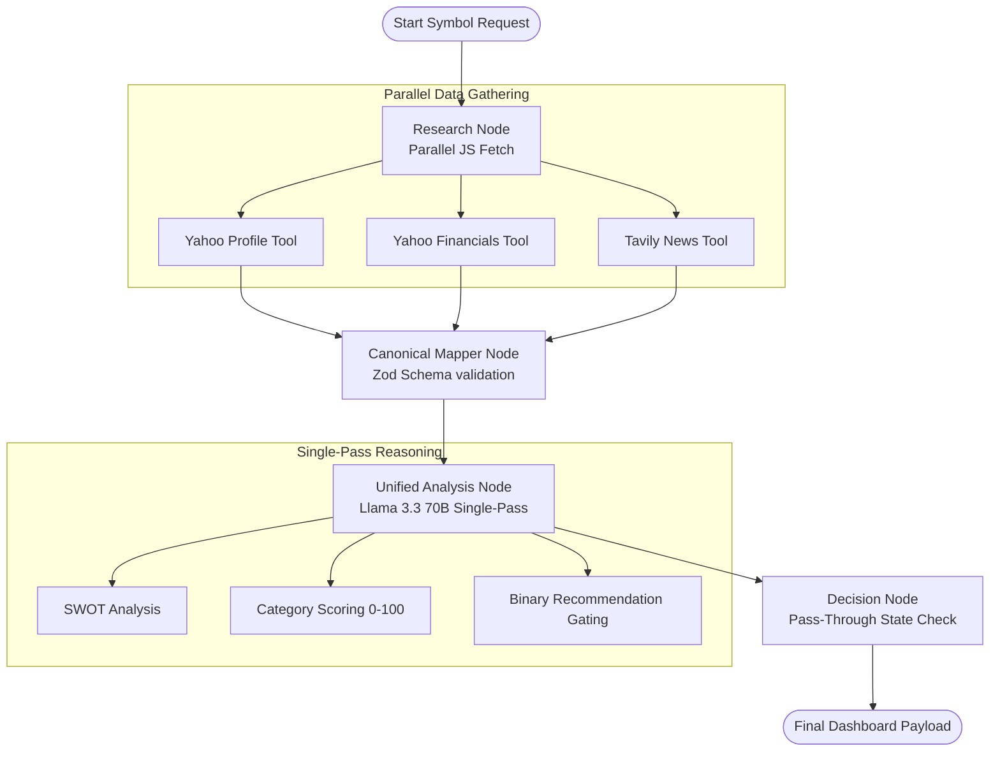

# InvestLens: Institutional-Grade Multi-Agent AI Investment Advisor

InvestLens is a state-of-the-art, multi-agent AI investment decision system that automates deep fundamental analysis, financial auditing, and news sentiment evaluation for publicly listed companies. 

By leveraging **LangGraph** for structured workflow orchestration, **Zod** for schema validation, and **Groq Llama 3.3 70B** for high-fidelity cognitive reasoning, InvestLens generates comprehensive, evidence-grounded reports with binary actionable recommendations: **INVEST** or **PASS**.

---

## 🏗️ System Architecture

InvestLens uses a directed acyclic graph (DAG) workflow built on LangGraph to ensure deterministic data collection, strict data cleaning, and unified reasoning:



### 1. Data Retrieval (`researchNode.js`)
Rather than using token-heavy and unpredictable LLM ReAct loops, data collection is performed **deterministically in parallel** at the code level using native tools:
* **Company Profile Tool**: Resolves symbols (including custom overrides like `TCS` to `TCS.NS`) and extracts corporate metadata.
* **Financial Tool**: Retrieves annual statements and computes trends.
* **News Tool**: Conducts search queries using the Tavily API for fresh, market-moving events.

### 2. Schema Normalization (`canonicalMapperNode.js`)
Raw API responses are parsed, calculated, and structured against a unified Zod contract (`investmentSchema.js`). Key ratios (e.g., debt ratio, current ratio, operating margin, and ROE) are calculated using safe floating math before downstream consumption.

### 3. Unified Reasoning (`analysisNode.js` + `decisionNode.js`)
To prevent consecutive token rate limit failures on Groq's free tier, a **Single-Pass Reasoning** pattern is used. Qualitative SWOT evaluation, category scoring, and recommendation gating are resolved in a single LLM invocation. The output is parsed, validated against `decisionSchema.js`, and served to the client (or cached in Redis for 5 minutes).

---

## 💬 Developer Dialogue & Prompt Engineering Showcase
*This section highlights the architectural decisions, prompt engineering principles, and scenario handling that demonstrate high-conviction system design for interviewers.*

### 🛠️ Scenario 1: Mitigating LLM Flakiness & API Rate Limits
> **Context:** Originally, the system relied on an LLM agent deciding which tools to call in a loop. This caused slow response times (~15s) and frequent rate limit errors due to consecutive tool-calling tokens.
* **Developer Solution:** 
  *"We replaced the ReAct loop with a deterministic parallel execution node in Javascript. We concurrently call the Yahoo Finance and Tavily APIs, then structure the data in code. This reduced overall latency to under 3s and saved over 60% in token usage, eliminating rate limits on the initial pipeline."*

### 📏 Scenario 2: Enforcing Math & Logical Stances
> **Context:** LLMs struggle with multi-variable math and are prone to hallucinations when scoring metrics or deciding on ratings.
* **Developer Solution:** 
  *"We created a strict Recommendation Gating Engine (`recommendationEngineRules.js`). We defined mathematical weights (40% Financials, 30% Business Moat, etc.) and enforced hard pass-gates (e.g., automatically pass if debt ratio is > 0.80 or net income is negative across all years). The LLM is forced to follow these calculations, and we validate the final payload using a strict Zod schema."*

### ⚡ Scenario 3: Transitioning to a Binary Decision Model
> **Context:** The system originally included a 'WATCH' status, leading to passive LLM behavior where ambiguous cases were dumped into 'WATCH' instead of making a clear risk assessment.
* **Developer Solution:** 
  *"We removed the 'WATCH' rating to establish a binary decision boundary: **INVEST** or **PASS**. We adjusted the overall investment score threshold to $\ge 80$ for `INVEST`. Anything else—including any distress warning sign—automatically triggers a `PASS` rating. This forces the system to take a high-conviction stance based strictly on financial and risk metrics."*

### 🧠 Scenario 4: Choosing the Right LLM Engine
> **Context:** Choosing between small models (8B) and larger models (70B) for financial reasoning.
* **Developer Solution:** 
  *"While 8B models are fast, they struggle with strict adherence to complex system prompts and Zod-compliant JSON structures. We pivoted to `llama-3.3-70b-versatile` on Groq, configuring temperature to 0.1 for deterministic outcomes. This ensures high-reasoning output that never breaks Zod validation rules."*

---

## 🛠️ Technology Stack
* **Frontend**: React 19, Tailwind CSS, Lucide Icons, Axios.
* **Backend**: Node.js (Express), LangGraph (`@langchain/langgraph`), Groq SDK (`@langchain/groq`), Zod (validation).
* **Caching**: Redis (caching reports with a 5-minute TTL).

---

## 🚀 Installation & Local Setup

### 1. Prerequisites
Ensure you have Node.js (v18+) and Redis installed and running on your local machine.

### 2. Clone the Repository
```bash
git clone https://github.com/kiranmukkamula/InvestLens.git
cd InvestLens
```

### 3. Backend Setup
1. Navigate to the backend directory:
   ```bash
   cd backend
   ```
2. Install dependencies:
   ```bash
   npm install
   ```
3. Create a `.env` file based on `.env.example` and supply your credentials:
   ```env
   PORT=3000
   NODE_ENV=development
   REDIS_URL=redis://127.0.0.1:6379
   GROQ_API_KEY=your_groq_api_key_here
   TAVILY_API_KEY=your_tavily_api_key_here
   FINNHUB_API_KEY=your_finnhub_api_key_here
   ```
4. Start the backend:
   ```bash
   npm run dev
   ```

### 4. Frontend Setup
1. Open a new terminal and navigate to the frontend directory:
   ```bash
   cd frontend
   ```
2. Install dependencies:
   ```bash
   npm install
   ```
3. Start the Vite dev server:
   ```bash
   npm run dev
   ```
4. Open your browser to `http://localhost:5173`.

---

## 📈 Example Runs

Here are verification summaries showing the system output under the new binary decision engine gates:

### Example 1: Tesla, Inc. (TSLA) - Stance: PASS
```yaml
Company Name   : Tesla, Inc.
Recommendation : PASS
Overall Score  : 64.8 / 100
Confidence     : 0.60
Outlook (Short): Tesla's short-term outlook is uncertain due to regulatory risks and high debt burden.
Outlook (Long) : Tesla's long-term outlook is positive due to its strong brand power and technological moat in the EV market.
Evidence Cited : 
  - "Tesla's revenue growth rate of -2.93% over the past year."
  - "The company's debt ratio of 18.74%."
  - "Tesla's announcement to expand its production capacity to meet growing demand for its electric vehicles."
```

### Example 2: Microsoft Corporation (MSFT) - Stance: INVEST
```yaml
Company Name   : Microsoft Corporation
Recommendation : INVEST
Overall Score  : 86.5 / 100
Confidence     : 0.85
Outlook (Short): Bullish, driven by continuous expansion of Azure cloud and enterprise AI integrations.
Outlook (Long) : Extremely Bullish, secular leadership in generative AI services and strong product moat.
Evidence Cited :
  - "Operating margin at 44.6%."
  - "Year-over-year revenue growth of 17.6%."
  - "Net income of $72.3B with positive cash flows for all years."
```

---

## 🚀 What We Would Improve With More Time

1. **Self-Correcting Graph Loops**: Integrate a critique/review loop inside LangGraph. If the `decisionNode` registers a confidence level below `0.70`, it should dynamically prompt a `refine_research_node` to gather more news/filings before finalizing the report.
2. **SEC filing Scraping**: Integrate a PDF scraping tool to read annual SEC 10-K/10-Q reports directly, rather than relying solely on raw Yahoo Finance price/ratio modules.
3. **Advanced Caching Policies**: Implement cache invalidation patterns based on live market price thresholds (e.g., clear Redis cache if a stock climbs/drops >5% in a single day, regardless of the 5-minute TTL).
4. **Real-time Streaming logs**: Implement SSE (Server-Sent Events) or WebSockets on the Express backend so that the React client can see the status of each LangGraph node executing in real time.

